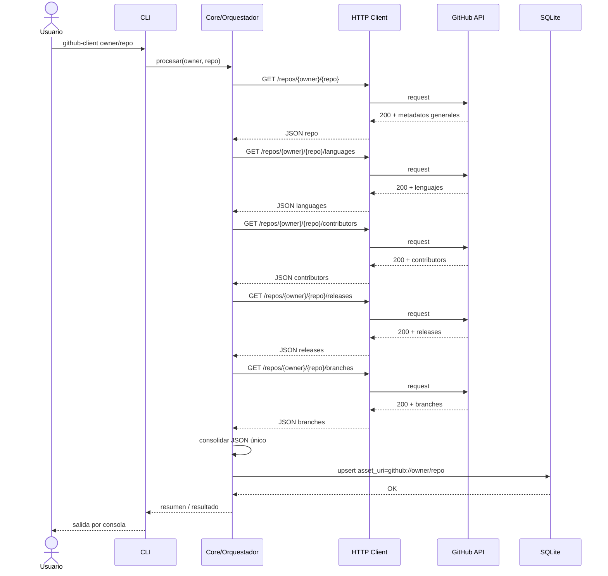

# Documento de Arquitectura — api-client-github

**Fase:** 0 — Definición y diseño inicial
**Contrato de software de referencia:** `README.md`

Este documento no redefine el contrato de software (ya está fijado en `README.md`); su objetivo es bajar ese contrato a una arquitectura concreta: componentes, flujo de datos y organización del código, tanto para el prototipo en Python (Fase 1) como para la implementación final en C (Fase 3).

---

## 1. Estructura de carpetas propuesta

```text
api-client-github/
├── README.md                    # Contrato de software (ya existente)
├── docs/
│   ├── architecture.md          # Este documento
│   └── workplan.md              # Plan de trabajo
│
├── prototype/                   # Fase 1 — Prototipo funcional en Python
│
├── src/                         # Fase 3 — Implementación final en C
│
├── tests/
│   ├── prototype/                # Pruebas del prototipo Python
│   └── c/                        # Pruebas de la versión en C
│
├── build/                        # Artefactos de compilación (gitignored)
├── Makefile                      # Build de la versión en C
└── .gitignore
```

---

## 2. Diagrama de componentes

```text
+-------------------+
|      Usuario       |
+---------+---------+
          |
          v
+-------------------+
|     CLI (main)     |   <owner>/<repo>
+---------+---------+
          |
          v
+-------------------+        +----------------------+
|   Core / Orquestador +----->|   HTTP Client         |
|   (core.c / core.py) |      |   (http_client)        |
+---------+---------+        +-----------+----------+
          |                              |
          | JSON crudo por endpoint      | HTTPS / TLS
          v                              v
+-------------------+        +----------------------+
|  JSON Parser /      |      |    GitHub REST API    |
|  Consolidador        |<-----+   api.github.com       |
+---------+---------+        +----------------------+
          |
          | JSON consolidado
          v
+-------------------+
|   Persistencia       |
|   SQLite (db)         |
+-------------------+
```

**Responsabilidad de cada componente:**

| Componente | Responsabilidad |
|---|---|
| CLI | Parsea el argumento `<owner>/<repo>`, invoca al orquestador y muestra el resultado/errores al usuario |
| Core / Orquestador | Dispara las 5 llamadas a la API en el orden definido, coordina reintentos ante 429 y arma el objeto consolidado |
| HTTP Client | Encapsula las llamadas GET a `api.github.com`, agrega headers obligatorios, interpreta códigos de estado (200/401/403/404/429) |
| JSON Parser / Consolidador | Extrae los campos relevantes de cada respuesta y los combina en la estructura del esquema JSON consolidado |
| Persistencia (SQLite) | Crea el esquema `assets` si no existe y hace upsert por `asset_uri` |

Este mismo diagrama aplica a ambas implementaciones (Python y C); lo que cambia entre fases es la tecnología detrás de cada caja, no la división de responsabilidades.

---

## 3. Diagrama de secuencia — Consulta compuesta

Secuencia de las 5 llamadas HTTP que se disparan por cada ejecución, según el orden definido en el contrato de software:



**Notas sobre el flujo:**

- Las 5 llamadas son secuenciales en esta primera versión (no hay paralelización); simplifica el manejo de rate limit y de errores parciales.
- Si cualquiera de las llamadas devuelve 401/403/404/429, el Core corta la secuencia y reporta el error puntual — no continúa con las llamadas restantes ni persiste un registro parcial.
- La escritura en SQLite ocurre una sola vez, al final, con el JSON ya consolidado (evita estados intermedios inconsistentes en la tabla `assets`).

---

