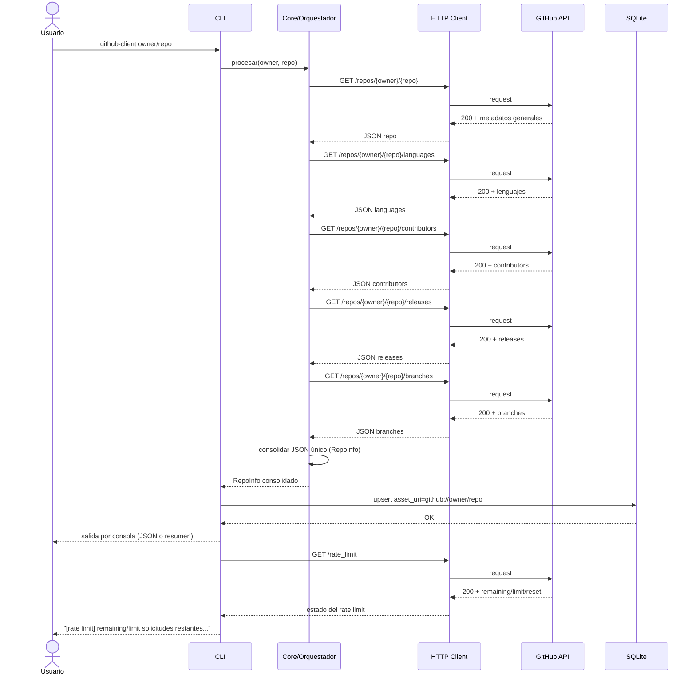

# Documento de Arquitectura — api-client-github

**Fase:** 0 — Definición y diseño inicial
**Contrato de software de referencia:** `README.md`

Este documento no redefine el contrato de software (ya está fijado en `README.md`); su objetivo es bajar ese contrato a una arquitectura concreta: componentes, flujo de datos y organización del código, tanto para el prototipo en Python (Fase 1) como para la implementación final en C (Fase 3).

---

## 1. Estructura de carpetas propuesta

```text
api-client-github/
├── README.md                    # Contrato de software + guía de instalación/uso
├── docs/
│   ├── architecture.md          # Este documento
│   └── workplan.md              # Plan de trabajo
│
├── prototype/                   # Fase 1 — Prototipo funcional en Python
│   ├── github_client.py         # Punto de entrada CLI
│   ├── http_client.py           # Cliente HTTP (requests)
│   ├── endpoints/
│   │   ├── repo.py
│   │   ├── languages.py
│   │   ├── contributors.py
│   │   ├── releases.py
│   │   └── branches.py
│   ├── consolidate.py           # Consolidación del JSON unificado
│   ├── db.py                    # Persistencia SQLite
│   ├── schema.sql
│   └── requirements.txt
│
├── src/                         # Fase 3 — Implementación final en C
│   ├── main.c                   # CLI
│   ├── core.c                   # Orquestador
│   ├── http_client.c            # Cliente HTTP (libcurl)
│   ├── json_parser.c            # Parsing/consolidación (cJSON)
│   ├── db.c                     # Persistencia (SQLite3)
│   └── models.c                 # Modelo de dominio
│
├── include/                     # Fase 3 — Headers públicos
│   ├── core.h
│   ├── http_client.h
│   ├── json_parser.h 
│   ├── db.h
│   └── models.h 
│
├── tests/
│   ├── prototype/                # Pruebas del prototipo Python
│   │   ├── comandos-manuales.md
│   │   └── informe_validacion.md # Validación y Variaciones
│   └── c/                        # Pruebas de la versión en C
│       ├── smoke_test.c
│       ├── test_*_unit.c         # Pruebas sin red. No consumen token
│       ├── test_*_live.c         # Pruebas contra api.github.com real
│       ├── comandos-manuales.md
│       └── checklist-criterios-exito.md
│
├── build/                        # Artefactos de compilación (gitignored)
├── github_client.db              # Persistencia (gitignored)
├── Makefile                      # Build de la versión en C
└── .gitignore
```

---

## 2. Diagrama de componentes

```text
                              +-------------------+
                              |      Usuario      |
                              +---------+---------+
                                        |
                                        v
                              +-------------------+
                              |   CLI (main.c)    |
                              +---------+---------+
                                        |
                    +-------------------+---------------------+
                    |                   |                     |
                    v                   v                     v
         +-------------------+   +--------------+   +---------------------+
         |  Core (core.c)    |   | JSON Parser  |   |   HTTP Client       |
         |  orquestador      |   |  (serialize) |   |   (http_client.c)   |
         +---------+---------+   +------+-------+   +-----------+---------+
                   |                    |                     |  ^
        +----------+-----------+        |                     |  |
        |                      |        |             (rate limit status,
        v                      v        v              consultado directo
+----------------+     +--------------------------+      por la CLI, sin
|  HTTP Client   |     |  JSON Parser             |      pasar por Core)
|  (5 llamadas)  |     |  (parse: JSON→RepoInfo)  |
+--------+-------+     +--------------------------+
         |
         v
+-------------------+
|   GitHub REST API |
+-------------------+

                              +-------------------+
                              |   Persistencia    |
                              |   SQLite (db.c)   |
                              +-------------------+
                                        ^
                                        |
                          (llamada DIRECTAMENTE por la CLI)
```

**Responsabilidad de cada componente:**

| Componente | Responsabilidad |
|---|---|
| CLI | Parsea el argumento `<owner>/<repo>`, invoca al orquestador, persiste en SQLite y muestra el resultado/errores al usuario |
| Core / Orquestador | Dispara las 5 llamadas a la API en el orden definido, puebla `RepoInfo`. No conoce SQLite ni argv ni stdout |
| HTTP Client | Encapsula las llamadas GET a `api.github.com`, agrega headers obligatorios, interpreta códigos de estado (200/401/403/404/429) |
| JSON Parser / Consolidador | Extrae los campos relevantes de cada respuesta y los combina en la estructura del esquema JSON consolidado |
| Persistencia (SQLite) | Crea el esquema `assets` si no existe y hace upsert por `asset_uri`. Solo la CLI la invoca |

Este mismo diagrama aplica a ambas implementaciones (Python y C); lo que cambia entre fases es la tecnología detrás de cada caja, no la división de responsabilidades.

---

## 3. Diagrama de secuencia — Consulta compuesta

Secuencia de las 6 llamadas HTTP que se disparan por cada ejecución:


```mermaid
sequenceDiagram
    actor U as Usuario
    participant CLI
    participant Core as Core/Orquestador
    participant HTTP as HTTP Client
    participant GH as GitHub API
    participant DB as SQLite

    U->>CLI: github-client owner/repo
    CLI->>Core: procesar(owner, repo)

    Core->>HTTP: GET /repos/{owner}/{repo}
    HTTP->>GH: request
    GH-->>HTTP: 200 + metadatos generales
    HTTP-->>Core: JSON repo

    Core->>HTTP: GET /repos/{owner}/{repo}/languages
    HTTP->>GH: request
    GH-->>HTTP: 200 + lenguajes
    HTTP-->>Core: JSON languages

    Core->>HTTP: GET /repos/{owner}/{repo}/contributors
    HTTP->>GH: request
    GH-->>HTTP: 200 + contributors
    HTTP-->>Core: JSON contributors

    Core->>HTTP: GET /repos/{owner}/{repo}/releases
    HTTP->>GH: request
    GH-->>HTTP: 200 + releases
    HTTP-->>Core: JSON releases

    Core->>HTTP: GET /repos/{owner}/{repo}/branches
    HTTP->>GH: request
    GH-->>HTTP: 200 + branches
    HTTP-->>Core: JSON branches

    Core->>Core: consolidar JSON único (RepoInfo)
    Core-->>CLI: RepoInfo consolidado

    CLI->>DB: upsert asset_uri=github://owner/repo
    DB-->>CLI: OK
    CLI-->>U: salida por consola (JSON o resumen)

    CLI->>HTTP: GET /rate_limit
    HTTP->>GH: request
    GH-->>HTTP: 200 + remaining/limit/reset
    HTTP-->>CLI: estado del rate limit
    CLI-->>U: "[rate limit] remaining/limit solicitudes restantes..."
```

**Notas sobre el flujo:**

- **Es el camino feliz.** Este diagrama no representa ramas de error ni la excepción
  de `contributors` (403 "too large to list...", que no corta la secuencia —
  ver `README.md`, sección "Consulta Compuesta") para mantenerlo legible.
- **Quién persiste es CLI, no Core** — `core.c` nunca incluye `db.h`; arma un 
  `RepoInfo` en memoria y se lo devuelve a la CLI, que es quien decide serializarlo, 
  guardarlo e imprimirlo.
- **Por qué el diagrama muestra 6 llamadas HTTP, no 5**: las primeras 5 (`repos`,
  `languages`, `contributors`, `releases`, `branches`) las dispara Core, como parte de la
  consulta compuesta. La 6ta (`/rate_limit`) la dispara la CLI directamente, después de
  imprimir la salida — Core no participa en esa última llamada.
- Las 5 llamadas de Core son secuenciales, sin paralelización.
- Si cualquiera de las llamadas devuelve 401/403/404/429, el Core corta la secuencia y reporta el error puntual — no continúa con las llamadas restantes ni persiste un registro parcial.

---

